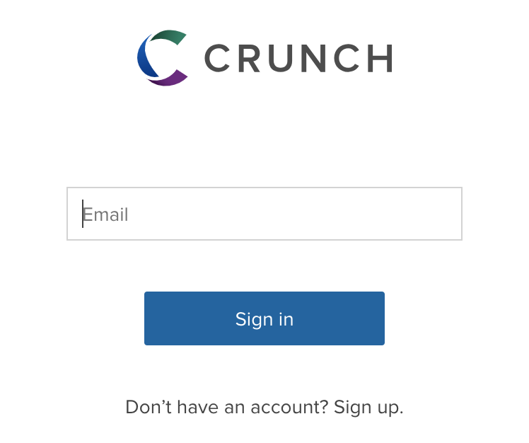
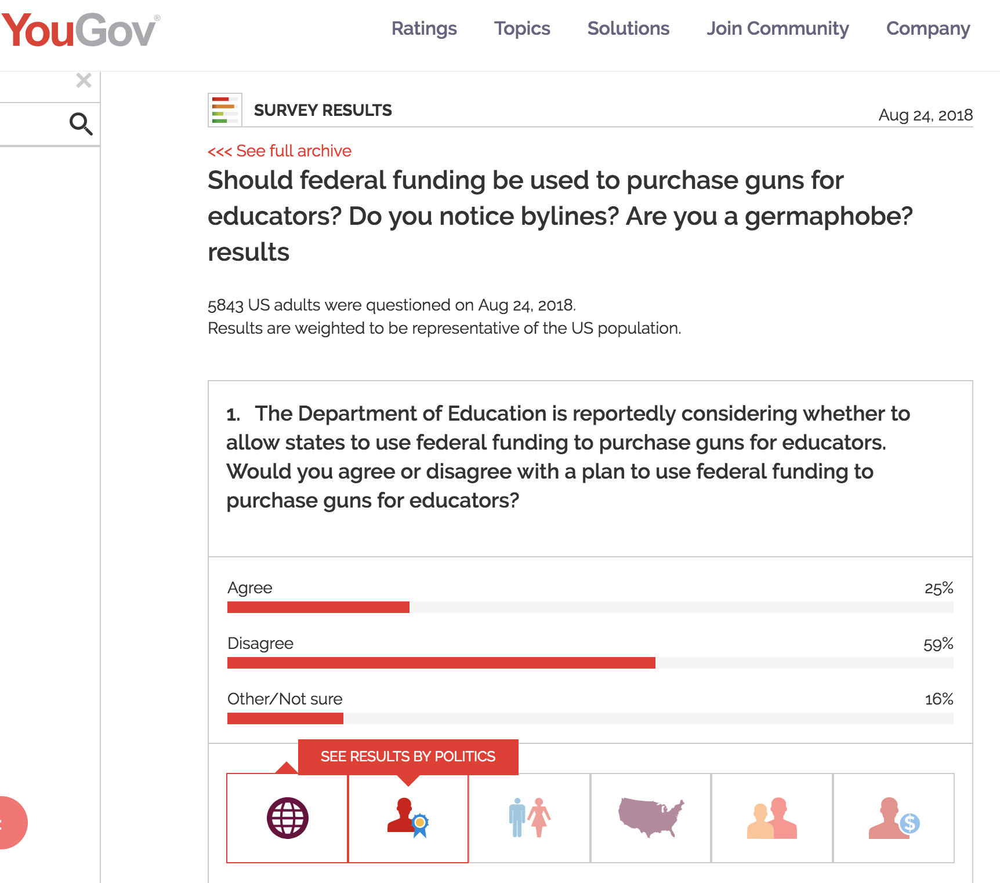
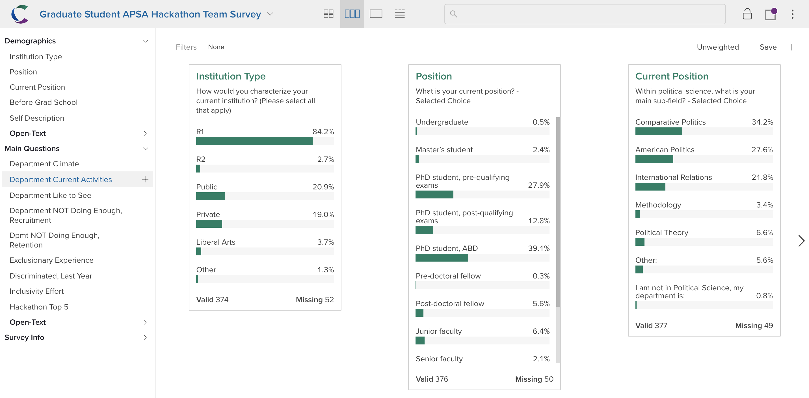
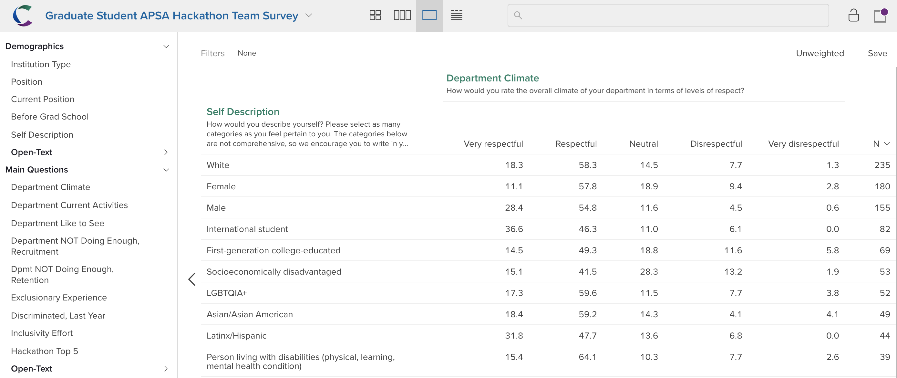
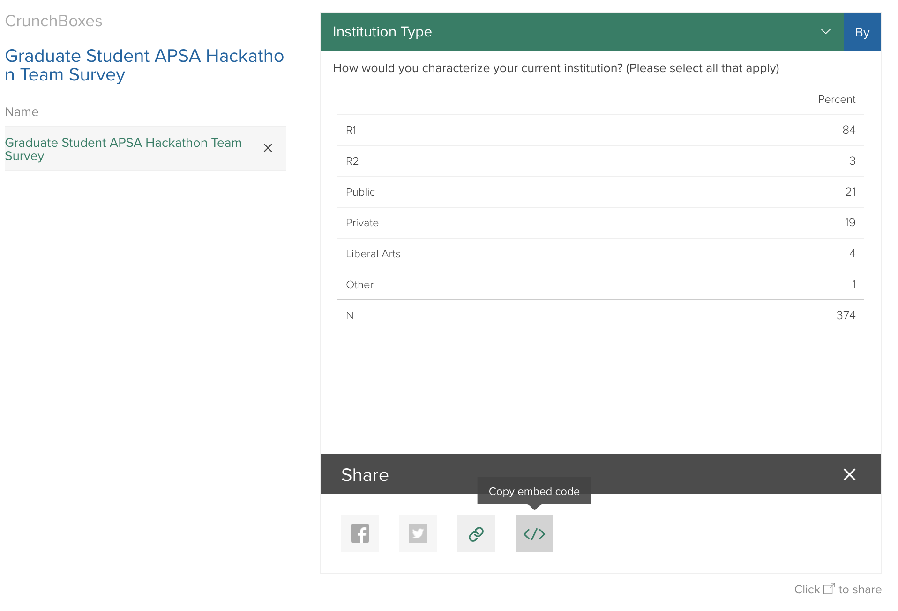
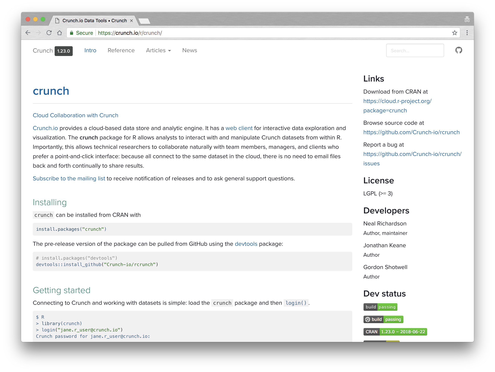

Introduction to Crunch: [github.com/APSAGradHack](https://github.com/APSAGradHack)
================

Shiro Kuriwaki[1]

(For more questions about Crunch today, email <support@crunch.io> or find John Ray (YouGov) - <john.ray@yougov.com>)

Why Crunch?
===========

Online surveys have become ubiquitous. But in practice there are barriers and frustration to making use of the data:

-   How do I download my data?
-   How do I analyze my data in R/Stata/Python?

Further in practice, we often face frustrations like:

-   "What question was `CC_321AH_vt`?"
-   Do I put my figures in PDF? PNG? Document in PDF? Word? PPT?
-   What if a colleague has follow-up data analyses?
-   After all this manipulation, how can I keep attributes like labels, question wordings, and display formats as shown?

Crunch is a online-based tool recently built to facilitate such collaboration.



Crunch Use-Cases
================

Some firms use Crunch to manage internal analytics, and/or showcase them for dissemination.



"Editors" can upload their own survey data (e.g. from Qualtrics or Survey Monkey) as `.csv` or `.sav` (SPSS) files. See for example: <https://cces.gov.harvard.edu/explore>

Note: We will add everyone as a Viewer by default, and give Editor access to the subteam focusing on Crunch. If you are an Editor, please do not add other users.

Logging in to the APSA Grad Hackathon Dataset
=============================================

1.  Sign up for a Crunch account
2.  Make sure John Ray or Shiro Kuriwaki gets your email
3.  Sign-in to your account, and you should see `"Graduate Student APSA Hackathon Team Survey"`[2]

GUI for Browsing
================

Machine-Readable is not necessary Human-Readable. Friction occurs for example when

-   The same variable should be named `pid_3` for data analysis, but named `"Partisan Identity (3-point)"` for presentation
-   "Grid questions" are separated into columns in a flat file (`Q1_A`, `Q1_B`, `Q1_C`), but should be presented back in its grid form
-   Variables come in the order they were presented, but a re-grouped order might be easier to navigate.



GUI for Analyzing
=================

Tailored specifically for surveys, Crunch has intuitive GUIs for

-   Top-lines
-   Cross-tabs
-   Figures
-   Analyzing by Subset

Also has survey-specific functionalities such as

-   Switching between weights
-   Grouping response choices



GUI for Sharing
===============

Crunch Editors can create html widgets of their datasets, that users can engage with (without releasing all raw data).



Scripting by R
==============

You can also extract, view, and edit Crunch datasets from the R package `crunch`.



``` r
install.packages("crunch")
```

Detailed step-by-step vignettes and help page exist to set up your password for easy login

``` r
library(crunch)
```

    ## 
    ## Attaching package: 'crunch'

    ## The following object is masked from 'package:utils':
    ## 
    ##     write.csv

    ## The following object is masked from 'package:base':
    ## 
    ##     table

``` r
login()
```

    ## Logged into crunch.io as kuriwaki@g.harvard.edu

Once logged in, loading a crunch dataset allows you to extract variables and tables from the R object:

``` r
ds <- loadDataset("Graduate Student APSA Hackathon Team Survey",
                  project = "APSA Hackathon")
```

familiar base-R syntax applies:

``` r
table(ds$Q6)
```

    ## Q6
    ##                             Comparative Politics 
    ##                                              129 
    ##                                American Politics 
    ##                                              104 
    ##                          International Relations 
    ##                                               82 
    ##                                      Methodology 
    ##                                               13 
    ##                                 Political Theory 
    ##                                               25 
    ##                                           Other: 
    ##                                               21 
    ## I am not in Political Science, my department is: 
    ##                                                3

or through more of `crunch`'s functions:

``` r
crtabs(~ Q6, ds)
```

    ## Q6
    ##                             Comparative Politics 
    ##                                              129 
    ##                                American Politics 
    ##                                              104 
    ##                          International Relations 
    ##                                               82 
    ##                                      Methodology 
    ##                                               13 
    ##                                 Political Theory 
    ##                                               25 
    ##                                           Other: 
    ##                                               21 
    ## I am not in Political Science, my department is: 
    ##                                                3

For an example of a R script that formats an existing crunch object that originated from a user-uploaded SPSS file, see <https://github.com/kuriwaki/cces_cumulative/blob/master/07_format-crunch.R>

Questions? Feedback?
====================

Email <support@crunch.io> for feedback, questions, or inquires about how you might use crunch for your other work.

[1] PhD Candidate, Harvard Department of Government. Unaffiliated with Crunch. <https://www.shirokuriwaki.com>

[2] If not, try this link after making an account: <https://app.crunch.io/dataset/2c7c25d41367416c82560928cc0ee258>
